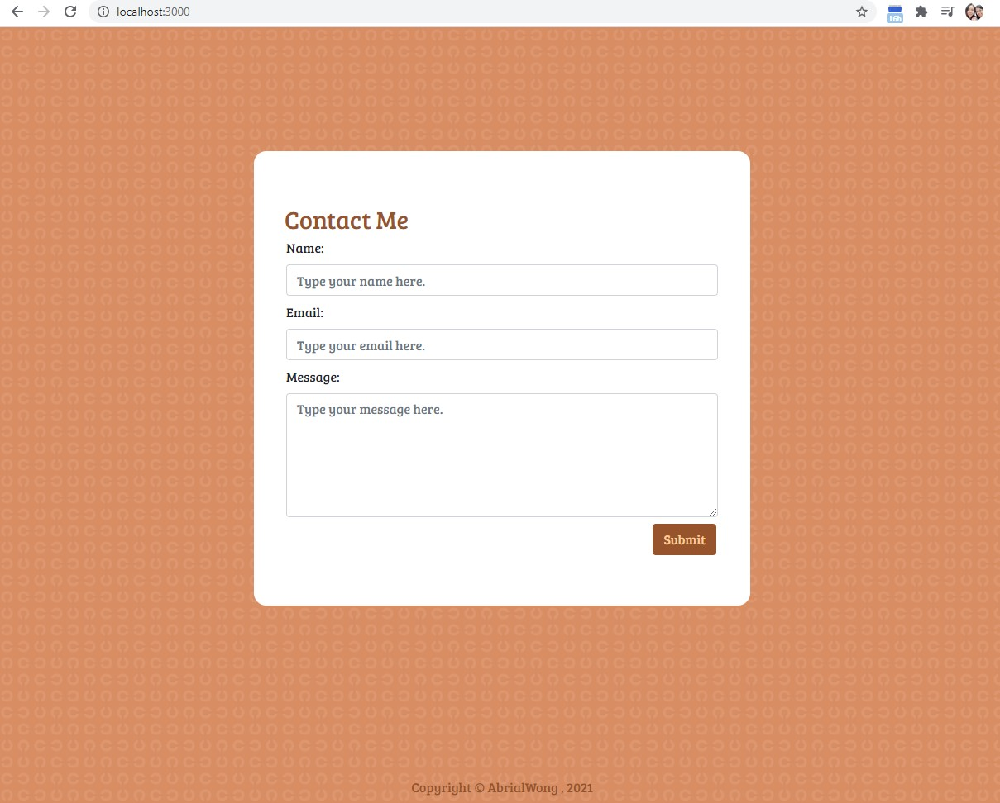
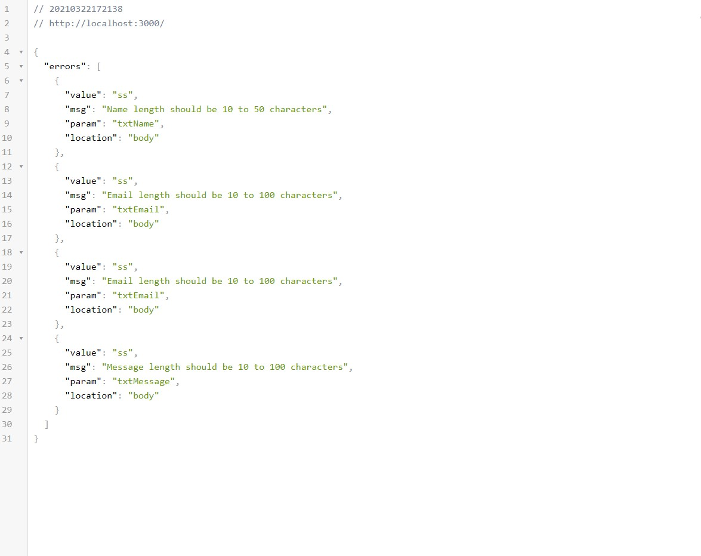
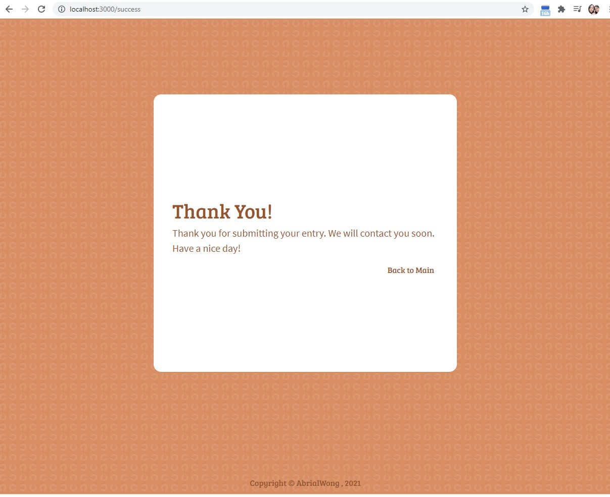

## Objectives
A simple contact form made with Html, SCSS, bootstrap,Ejs and validate data using express validator in node.js.

## Getting Started

### Prerequisites

Things to install:
```
1) Node
2) Any Text Editor eg. Atom, Visual Studio Code
```
**- Currently I'm running on -** <br>
*Operating system* :  Windows 10 Pro<br>
*Node* :  v14.16.10

## Installation

**Windows**
1) Installing node
- Download the installer from <a href="https://nodejs.org/en/">node.js</a> website.
- Choose the LTS version on the left.
- Run the installer and follow the prompts in the installer
- Restart your computer
- Run ```node --version``` on your command prompt to check that your node has been installed successfully.

## Running the tests <br>

> To create this project from scratch 

**Windows** <br>
Step 1: Change directory to your working directory
```
cd <folderName>
```
Step 2: Initialised npm and also creates the package.json file
```
npm init
```
Step 3:  Install the express,node-sass, node-sass-middleware nodemon express-validator package using npm
```
npm install express node-sass node-sass-middleware nodemon express-validator
```
Step 4:  Install nodemon package globally using npm
```
npm install -g nodemon
```
Step 5:  Install body-parser package  using npm
```
npm install body-parser
```
Step 6:  Install sass package globally using npm
```
npm install -g sass
```
Step 7:  Make a new scss folder
```
mkdir scss
```
Step 8 : Make a new css folder
```
mkdir public/css
```
Step 9 : Run the following command to compile scss into css.
```
sass --watch scss:public/css
```

> Using existing project

**Windows**
Step 1:  Open up a command prompt
```
open command prompt / hyper
```
Step 2:  Change directory to your folderName
```
cd [folderName]
```
Step 3: git clone or download the following project into your working directory
```
git clone "https://github.com/AbrialWong/Portfolio/Contact-form"
```
Step 3: Run npm install / npm i to download the missing node_modules fles
```
npm install or npm i
```
Step 4: Run nodemon validation.js / node validation.js
```
nodemon validation.js or node validation.js
```
Step 5: Run sass --watch scss:public/css to compile your scss into css
```
Run sass --watch scss:public/css
```

## Expected output
Main page output<br>
<br><br>

Error page output<br>
<br><br>

Thank you page output<br>
<br><br>

## Authors
<a href="https://github.com/AbrialWong">Abrial Wong</a>

## Languages Used
<b>HTML , CSS, SCSS, Node, Express, EJS </b> 

## Acknowledgments
Credits to:- 
1) Angela Yu Web Development Bootcamp 2021 
* Node.js, Express.js, Bootstrap, EJS Module
2) https://www.geeksforgeeks.org/how-to-validate-data-using-express-validator-module-in-node-js/
