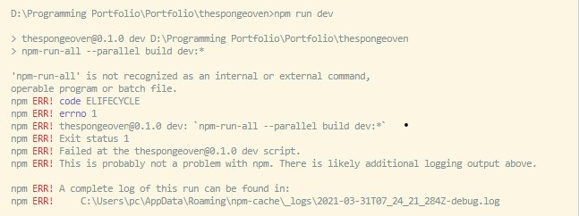

## Objectives
This is the e-commerce site for The Sponge Oven.

## Output 
A random superhero name will be generated

## Getting Started

### Prerequisites

Things to install:
```
1) Node
2) Any Text Editor eg. Atom, Visual Studio Code
```
**- Currently I'm running on -** 
*Operating system* :  Windows 10 Pro
*Node* :  v14.16.10

## Installation
**Windows**
Step 1:

```
 
```

And repeat

```
until finished
```

End with an example of getting some data out of the system or using it for a little demo
**Mac (Catelina)**

Say what the step will be

```
Give the example
```

And repeat

```
until finished
```

End with an example of getting some data out of the system or using it for a little demo

## Running the tests from scratch

**Windows**
Step 1:  Open up a command prompt
```
open command prompt / hyper `
```
Step 2:  Change directory to your folderName
```
cd [folderName]
```

Step 3: Run npm install express nodemon
```
npm install or npm i
```
Step 4: Run nodemon index.js / node index.js
```
nodemon index.js or node index.js
```

## Error faced
**Error 1:**<br>

<b> Solution: </b><br>
https://stackoverflow.com/questions/54525742/npm-run-all-is-not-recognized-as-an-internal-or-external-command
https://stackoverflow.com/questions/11928013/node-env-is-not-recognized-as-an-internal-or-external-command-operable-comman

## Authors
<a href="">Abrial Wong</a>

## Copyright
All images and details used in this project belongs to <a href="https://github.com/AbrialWong">Abrial Wong</a>. Do not mis-used it in any way or delete away this file. Thank you. 


## Acknowledgments
Special thanks to:- 
1) https://www.digitalocean.com/community/tutorials/react-server-side-rendering
